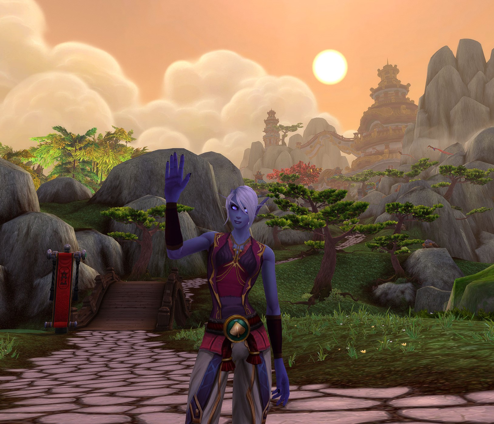
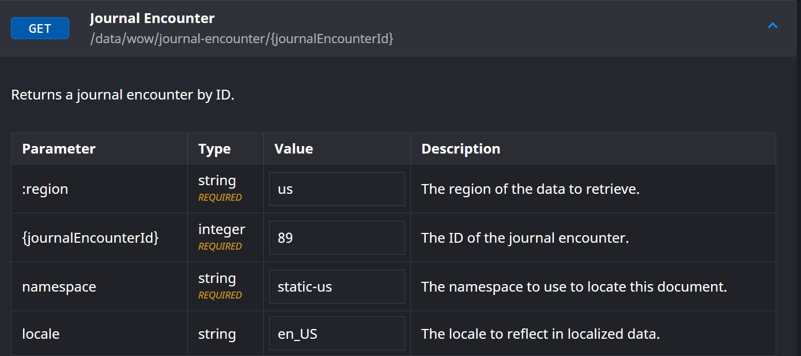

::: block

## More than a hobby

A side project formed out of a long time hobby.

<small>By: [Nicola Greco](https://github.com/obscurelyme)</small>

:::

---

## Currently

- Senior Frontend Software Engineer at Outreach
  - Member of the voice experience team
  - Some of our largest clients
    - Door Dash
    - American Express
    - T-Mobile
  - Projects I led
    - Phone number purchase/import
    - Trusted Caller
    - Admin Quality Control

---

### Phone number purchase/import

Allows for end users to purchase individual phone numbers for themselves or in bulk for other multiple users

OR

Allowed individuals to import existing phone numbers

---

### Trusted Caller

A project fully centered around SHAKEN/STIR protocol

---

### Admin Quality Control

List of feature requirements by AMEX

- Automatic inbound call recording
- Call log requirements for QA

---

## Other places I have worked

- Vanguard - Malvern, PA
- Brolik - Philadelphia, PA

---

## Hobby Time

- Running
- Cooking
- Traveling
- Game Programming
- I play World of Warcraft. {.fragment}

---



---

## Obscure Logs

--

- A _work in progress_ passion project
- Allow for a simple dive into the events a player partakes in during their adventures within the World of Warcraft universe {.fragment}

---

## Inspiration

- Passion for the game
- Curiosity
- [Warcraft Logs](https://warcraftlogs.com)

---


---

## An Example

```text
11/27 20:57:08.959  COMBAT_LOG_VERSION,20,ADVANCED_LOG_ENABLED,1,BUILD_VERSION,10.2.0,PROJECT_ID,1
11/27 20:57:08.959  ZONE_CHANGE,1466,"Darkheart Thicket",23
11/27 20:57:08.959  MAP_CHANGE,733,"Darkheart Thicket",3354.169922,2604.169922,2241.669922,1116.670044
11/27 20:57:09.520  SPELL_PERIODIC_HEAL,Player-61-0E2B8041,"Ilmarion-Zul'jin",0x512,0x0,Player-61-0F381A81,"Dntpncplz-Zul'jin",0x512,0x0,188550,"Lifebloom",0x8,Player-61-0F381A81,0000000000000000,1373820,1373820,15697,1423,13669,0,17,0,120,0,3247.98,1828.70,733,3.1738,475,8283,8283,8283,0,1
11/27 20:57:09.672  SPELL_PERIODIC_HEAL,Player-61-0E2B8041,"Ilmarion-Zul'jin",0x512,0x0,Player-61-0F381A81,"Dntpncplz-Zul'jin",0x512,0x0,391891,"Adaptive Swarm",0x20,Player-61-0F381A81,0000000000000000,1373820,1373820,15697,1423,13669,0,17,0,120,0,3247.98,1828.70,733,3.1738,475,10981,10981,10981,0,1
11/27 20:57:09.956  SPELL_PERIODIC_HEAL,Player-61-0E2B8041,"Ilmarion-Zul'jin",0x512,0x0,Player-61-0F381A81,"Dntpncplz-Zul'jin",0x512,0x0,774,"Rejuvenation",0x8,Player-61-0F381A81,0000000000000000,1373820,1373820,15697,1423,13669,0,17,0,120,0,3247.98,1828.70,733,3.1738,475,8697,8697,8697,0,nil
11/27 20:57:10.087  SPELL_AURA_APPLIED,Player-61-0E2B8041,"Ilmarion-Zul'jin",0x512,0x0,Player-61-0E2B8041,"Ilmarion-Zul'jin",0x512,0x0,1126,"Mark of the Wild",0x8,BUFF
11/27 20:57:10.087  SPELL_CAST_SUCCESS,Player-61-0E2B8041,"Ilmarion-Zul'jin",0x512,0x0,Player-61-0F381A81,"Dntpncplz-Zul'jin",0x512,0x0,1126,"Mark of the Wild",0x8,Player-61-0E2B8041,0000000000000000,589900,589900,11933,11474,4110,0,0,240040,250000,10000,3245.44,1831.16,733,4.6032,453
11/27 20:57:10.087  SPELL_AURA_APPLIED,Player-61-0E2B8041,"Ilmarion-Zul'jin",0x512,0x0,Player-61-0F381A81,"Dntpncplz-Zul'jin",0x512,0x0,1126,"Mark of the Wild",0x8,BUFF
11/27 20:57:10.087  SPELL_AURA_APPLIED,Player-61-0E2B8041,"Ilmarion-Zul'jin",0x512,0x0,Player-57-0D814CC1,"Demonlg-Illidan",0x512,0x0,1126,"Mark of the Wild",0x8,BUFF
11/27 20:57:10.088  SPELL_AURA_APPLIED,Player-61-0E2B8041,"Ilmarion-Zul'jin",0x512,0x0,Player-76-0BA39945,"Obscurekitty-Sargeras",0x511,0x0,1126,"Mark of the Wild",0x8,BUFF
11/27 20:57:10.289  SPELL_PERIODIC_HEAL,Player-61-0E2B8041,"Ilmarion-Zul'jin",0x512,0x0,Player-61-0F381A81,"Dntpncplz-Zul'jin",0x512,0x0,188550,"Lifebloom",0x8,Player-61-0F381A81,0000000000000000,1373820,1373820,15697,1423,13669,0,17,0,120,0,3247.98,1828.70,733,3.1738,475,4248,4248,4248,0,nil
11/27 20:57:10.502  SPELL_HEAL,Player-61-0E2B8041,"Ilmarion-Zul'jin",0x512,0x0,Player-57-0D814CC1,"Demonlg-Illidan",0x512,0x0,81269,"Efflorescence",0x8,Player-57-0D814CC1,0000000000000000,781326,781326,14444,1423,4848,0,17,0,120,0,3247.10,1825.83,733,3.1341,476,3539,3539,3539,0,nil
11/27 20:57:10.502  SPELL_HEAL,Player-61-0E2B8041,"Ilmarion-Zul'jin",0x512,0x0,Player-61-0F381A81,"Dntpncplz-Zul'jin",0x512,0x0,81269,"Efflorescence",0x8,Player-61-0F381A81,0000000000000000,1373820,1373820,15697,1423,13669,0,17,0,120,0,3247.98,1828.70,733,3.1738,475,6786,6786,6786,0,nil
11/27 20:57:10.504  SPELL_HEAL,Player-61-0E2B8041,"Ilmarion-Zul'jin",0x512,0x0,Player-76-0BA39945,"Obscurekitty-Sargeras",0x511,0x0,81269,"Efflorescence",0x8,Player-76-0BA39945,0000000000000000,534120,534120,10444,10042,3929,0,8,0,1000,0,3247.98,1828.70,733,3.1738,442,3463,3463,3463,0,nil
11/27 20:57:10.512  SPELL_AURA_APPLIED,Player-61-0E2B8041,"Ilmarion-Zul'jin",0x512,0x0,Player-76-0BA39945,"Obscurekitty-Sargeras",0x511,0x0,207386,"Spring Blossoms",0x8,BUFF
11/27 20:57:10.512  SPELL_AURA_APPLIED,Player-61-0E2B8041,"Ilmarion-Zul'jin",0x512,0x0,Player-61-0F381A81,"Dntpncplz-Zul'jin",0x512,0x0,207386,"Spring Blossoms",0x8,BUFF
```

--

```ts
interface CombatEvent {
  guid: string;
  timestamp: number;
  eventName: string;
  payload: string;
}
```

[Wowpedia Documentation](https://wowpedia.fandom.com/wiki/COMBAT_LOG_EVENT#Advanced_Combat_Log)

---

## The Design

---


---

## Monorepo

--

Contains all source code in a single location

--

Including this very presentation

--

Loosely coupled dependencies

---

## Dry Run

NodeJS Command Line Application

```bash
node ./parse-logs.js ./log.txt
```

| Pros                      | Cons                         |
| :------------------------ | :--------------------------- |
| Super fast iteration time | No UI 😔                     |
|                           | Loads of missing information |

---

##

```text
ENCOUNTER_START,1146,"Randolph Moloch",1,5,34
...
ENCOUNTER_END,1146,"Randolph Moloch",1,5,1,31231
```

--

```ts
interface Encounter {
  startTime: number;
  endTime: number;
  wowEncounterId: number; // NOTE: Houston, we have a problem
  reportGuid: string;
  guid: string;
  name: string;
  success: number;
  difficultyId: number;
  numPlayers: number;
}
```

--



--

[Wago Tools](https://wago.tools/db2/JournalEncounter)

---

## How it works

DEMO TIME!!

---

## Roadmap

More event logging and player detail

---

## Conclusion

---

## Thank You

Q & A
